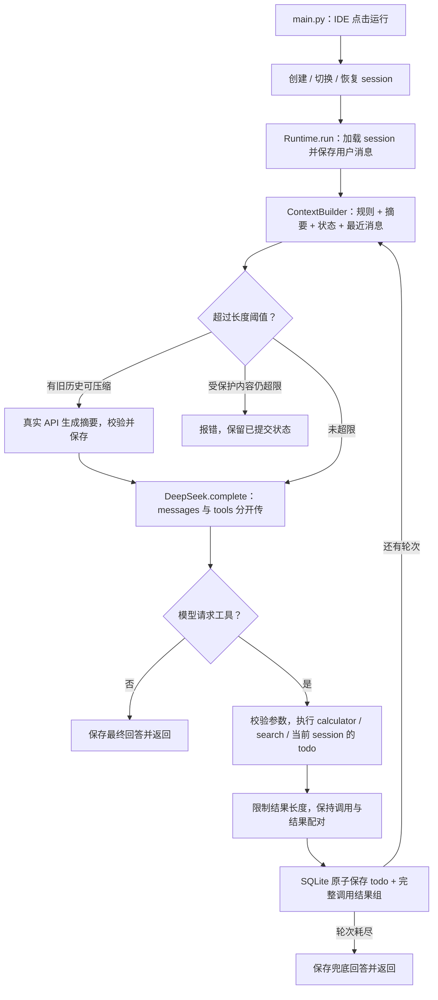

# 本次修改后的设计与 Review 顺序

工具 Schema 仅由注册表生成后交给 API，未混入历史。模型调用前说明与 trace 不进入持久化历史。压缩按完整用户轮次切分，当前轮次和最近对话保留；摘要无效时不替换旧历史。压缩后仍超限会报错，图中的摘要到模型调用之间也包含此检查。

建议按以下顺序 review，优先关注这次变化，不需要重新逐行阅读算术解析器。

| 顺序 | 文件 / 方法 | 本次变化与 review 重点 |
| --- | --- | --- |
| 1 | main.py / main | 唯一运行入口。IDE 直接运行；数据库和 .env 相对项目根定位；创建、切换、恢复、继续中断请求的选项。 |
| 2 | agent/sessions.py / Session、SessionStore | 新增。user_id/session_id 归属检查；history/summary/todos 快照；当前选择持久化；save 的 revision 条件更新和事务。 |
| 3 | agent/runtime.py / run、resume、_run | 重写。每次请求重新加载；保存用户输入；每轮构造 context；调用真实 API；保存最终答案；异常时保留已提交状态。 |
| 4 | agent/context.py / messages、split、build、apply_summary | 新增。context 内容、字符阈值、完整轮次切分、真实 API 摘要与校验、压缩后的二次预算检查。 |
| 5 | agent/llm.py / complete | 保留真实 API 路径，移除替代客户端接口说明；配置请求超时和有限重试；在 _normalize 中验证原始响应结构、结束状态和调用 ID。messages 和 tools 分开提供。 |
| 6 | agent/tools_impl.py / TodoStore、build_registry | todo 绑定当前 Session；ID 在 session 内递增；不再拥有独立内存列表；search 已补为真实百科 API 检索，不返回固定数据。 |
| 7 | agent/tools.py / validate_arguments | 补充字符串、整数与 enum 校验，避免无效数据写入 todo。 |
| 8 | 回到 runtime.py 的工具循环 | 检查客户端先校验整组 ID、错误作为工具结果、截断后有效 JSON、调用结果配对，以及 todo 和消息的一次原子提交。 |
| 9 | tests/test_acceptance.py、tests/test_sessions_context.py、tests/test_real_api.py | 看隔离、重启、冲突、配对、摘要失败、超限边界；真实 API 全流程测试需显式开启。 |

改动范围：新增 main.py、sessions.py、context.py 和两份测试；修改 runtime.py、llm.py、tools_impl.py、tools.py、包导出与文档；删除 cli.py、fake.py、原运行时测试和旧 examples/real_api.py 入口。

Review 时特别注意：

- 默认当前 session 按用户保存；两个窗口需要明确传各自的 session_id。
- SQLite 事务提交的是一整轮工具调用与结果，避免保存半组 tool 消息。
- revision 冲突不会自动重试工具操作，调用方需重新加载后决定如何继续。
- 最近对话不能压缩到预算内时明确报错，不拆工具配对，也不静默丢弃未完成 todo。
- 摘要会替换旧历史；它不是无损归档。未完成 todo 另外保存为结构化状态。
- API 异常后使用 resume 继续，不会重新追加问题或重做已提交工具，沿用已持久化的剩余步骤预算；正常 run 则代表新问题。

最新验收结果与逐项测试映射见 [ACCEPTANCE.md](ACCEPTANCE.md)。真实网络集成与可重复的 HTTP 边界测试分开报告。
